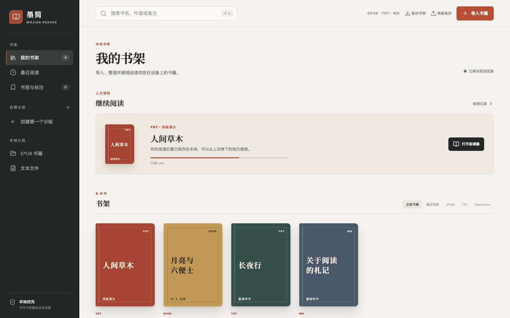
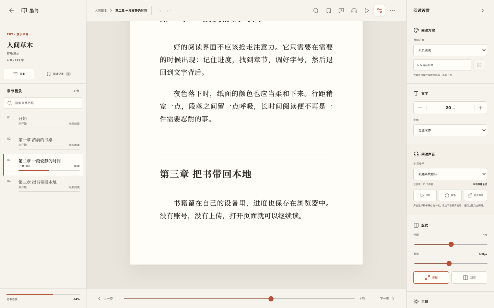

<div align="center">
  
  <h1>墨简 · Mojian Reader</h1>
  <p>隐私优先、离线可用的浏览器本地电子书阅读器。</p>
  <p>在一处整理、阅读和标注 EPUB、TXT 与 Markdown；书籍正文默认只保存在当前浏览器。</p>

  <p>
    
    
    
    
  </p>
</div>

## 界面预览

> 以下截图来自全新的隔离浏览器环境，仅使用项目内置样书和合成演示数据，不包含真实书籍、用户备注、阅读记录或本地路径。

### 本地书架



### 自建分组


### 沉浸阅读



## 项目定位

墨简面向希望直接在浏览器中管理本地电子书的读者。它不要求注册账号，也不依赖服务端保存正文；导入的书籍、阅读位置、书签和偏好主要存放在浏览器的 IndexedDB 与 Local Storage 中。

项目界面以“安静的桌面阅读工作台”为设计方向：深墨侧栏承担导航，纸张色内容区承载阅读，陶土红只用于当前状态与关键操作。

## 核心能力

| 领域 | 能力 |
| --- | --- |
| 本地书库 | 文件选择与拖拽批量导入、格式筛选、书名 / 作者 / 备注搜索、章节数与字数展示 |
| 书架整理 | 自建分组、多分组归属、分组重命名与安全删除、最近阅读 |
| 书籍资料 | 编辑书名、作者、备注、封面，以及仅对单本书生效的阅读背景 |
| 深度阅读 | 章节目录、目录搜索、全文搜索、前进 / 后退阅读位置、连续与双页布局 |
| 阅读辅助 | 书签、文字标注、带出处复制、阅读标尺、句子级自动滚动高亮 |
| 朗读与统计 | 调用浏览器 / 系统语音、每本书独立声音偏好、阅读时长与剩余时间估算 |
| 数据安全 | 本地持久化、书架完整备份与恢复、PWA 应用壳离线缓存 |
| 可访问性 | 键盘焦点、语义标签、减少动态效果偏好和高对比状态反馈 |

## 支持格式

| 格式 | 状态 | 说明 |
| --- | --- | --- |
| EPUB | 已支持 | 基于 `epub.js` / `react-reader` 渲染，支持目录、搜索、进度和标注 |
| TXT | 已支持 | 支持 UTF-8、GBK / GB18030 等常见编码探测和大文件分段索引 |
| Markdown | 已支持 | 支持常见标题、段落和列表的阅读排版 |
| PDF / MOBI / CBZ | 尚未支持 | 当前界面不会将这些格式标记为可用能力 |

## 快速开始

### 环境要求

- Node.js 20 或更高版本
- npm
- 现代桌面浏览器，推荐最新版 Chrome / Edge

### 本地运行

```bash
git clone https://github.com/Ax-For/mojian-reader.git
cd mojian-reader
npm ci
npm run dev
```

默认开发地址：<http://127.0.0.1:5173/>

### 生产构建

```bash
npm run build
npm run preview -- --host 127.0.0.1
```

构建结果位于 `dist/`。

## 使用流程

1. 点击“导入书籍”或将 EPUB、TXT、Markdown 文件拖入书架。
2. 通过书籍右上角的管理入口编辑资料，并加入一个或多个自建分组。
3. 打开阅读器后使用目录、全文搜索、标注、自动滚动和朗读工具。
4. 定期使用“备份书架”导出书籍、阅读记录、偏好与分组信息。

## 数据与隐私

- 书籍正文不会由项目主动上传到远程服务器。
- 本地书籍及大体积正文保存在 IndexedDB；分组和轻量偏好保存在 Local Storage。
- 封面、阅读背景、书签、标注和阅读进度跟随本地书架保存。
- 完整备份文件由浏览器在本地生成，恢复前会校验文件结构与数据范围。
- 清除站点数据、使用隐私模式或更换浏览器配置可能导致本地书架丢失，请主动保留备份。
- 系统朗读可用声音由浏览器与操作系统提供，不由墨简下载或托管。

## 开发与验证

| 命令 | 用途 |
| --- | --- |
| `npm run dev` | 启动 Vite 开发服务器 |
| `npm run preview` | 本地预览生产构建 |
| `npm run build` | TypeScript 检查并生成生产构建 |
| `npm run lint` | 执行 ESLint 静态检查 |
| `npm test` | 运行 Vitest 单元与组件测试 |
| `npm run test:coverage` | 生成测试覆盖率报告 |
| `npm run e2e` | 使用 Playwright 运行端到端测试 |

当前回归基线覆盖书架、书签、章节进度、全文搜索、自动滚动、语音偏好、元数据编辑、大文件阅读和自建分组等关键流程。

## 项目结构

```text
src/
├── components/   # 书架、阅读器、资料编辑与标注界面
├── services/     # IndexedDB、备份、偏好、统计与分组持久化
├── utils/        # 格式解析、编码识别、搜索与内容指标
├── workers/      # 大文件导入、索引与全文搜索 Worker
├── data/         # 内置演示书籍
└── App.tsx       # 应用状态与主流程编排

e2e/              # Playwright 端到端测试
public/           # PWA manifest、图标与 Service Worker
docs/screenshots/ # 使用隔离演示数据生成的公开截图
```

## 设计与实现参考

墨简借鉴了成熟阅读器的交互经验，但界面和实现均围绕浏览器本地阅读重新设计：

- [Koodo Reader](https://github.com/koodo-reader/koodo-reader)：本地书库、多格式导入与排版控制
- [Readest](https://github.com/readest/readest)：沉浸阅读、书架管理与连续 / 分页阅读
- [Foliate](https://github.com/johnfactotum/foliate)：阅读进度、带出处复制与轻量阅读工具
- [Thorium Reader](https://github.com/edrlab/thorium-reader)：目录、位置历史、键盘导航与无障碍设计
- [KOReader](https://github.com/koreader/koreader)：前后阅读位置跳转与深度阅读工作流
- [epub.js](https://github.com/futurepress/epub.js) / [React Reader](https://github.com/gerhardsletten/react-reader)：浏览器端 EPUB 渲染

## 后续方向

- PDF、MOBI、CBZ 等更多格式
- 可选的跨设备同步与冲突处理
- 可安装语音引擎与更细粒度的角色声音方案
- 更完整的阅读统计、批量书籍管理和导入诊断

## 许可证

当前仓库尚未声明开源许可证。代码公开可见，但在许可证补充前不代表自动授予复制、修改或再分发权限。
